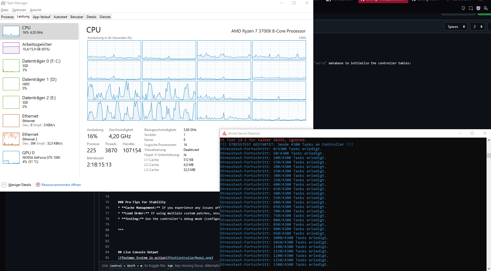

Module Controller (sController)


Overview
The sController is a high-performance, robust backend framework designed for AzerothCore. It serves as a centralized communication hub and task management engine, specifically engineered to handle complex data exchange between various server modules. By providing a stable, low-overhead bridge, it ensures seamless integration and reliable operation of custom server features, even under high-load scenarios.

Core Capabilities
High-Throughput Task Processing: Built to handle thousands of concurrent operations efficiently, ensuring that complex background tasks do not interfere with server performance or client-side stability.

Centralized Data Hub: Acts as a master controller for inter-module communication, streamlining data flow and reducing dependency conflicts between disparate components.

Custom Asset & Environment Support: Optimized for the management of custom game objects and unique map environments (such as custom Gildenmaps), providing consistent handling of database definitions and model validations.

Production-Ready Stability: Rigorously tested under load (e.g., handling 4,000+ concurrent tasks), the architecture is designed to minimize latency and prevent synchronization issues in dynamic, module-heavy setups.

Technical Implementation
The sController utilizes an efficient threading model that distributes logic processing effectively across available CPU resources. It is designed to work in tandem with custom patch files (e.g., Patch-M.MPQ), enabling developers to deploy sophisticated housing systems, custom building displays, and unique map functionalities without compromising the integrity of the core server environment.

Use Cases
Custom Housing Systems: Managing thousands of player-owned objects and their respective states.

Dynamic Event Controllers: Handling large-scale server events that require synchronized data updates.

Custom Map Frameworks: Providing the necessary backend logic for unique, non-standard map layouts and building integrations.


##Installation & Setup Guide
This guide covers the deployment of the sController module within your AzerothCore environment.

Prerequisites
AzerothCore: Ensure your core is up to date (master branch recommended).

Compiler: A C++ compiler (Visual Studio 2019/2022 or GCC 10+).

Database: Access to your World/Auth database to apply necessary SQL patches.

Step-by-Step Installation
Clone the Repository:
Navigate to your AzerothCore modules directory and clone the sController repository:

cd /path/to/azerothcore/modules
git clone [URL-DEINES-REPOS] sController


2.  **Apply Database Updates:**
    Locate the `data/sql/` folder within the module directory. Execute the provided SQL files against your `world` database to initialize the controller tables:
    ```sql
    -- Example command (adjust to your DB tool)
    source /path/to/modules/sController/data/sql/db_update.sql
Compile the Core:
Run the CMake configuration again to detect the new module, then recompile your core:

Bash
cd /path/to/azerothcore/build
cmake ../ -DCMAKE_INSTALL_PREFIX=../dist -DMODULES=sController
make -j$(nproc)
make install

4.  **Configure the Environment:**
    Open your `worldserver.conf` and adjust the module-specific settings if necessary. Ensure the `sController` is enabled (default is 1).

5.  **Client-Side Integration (Optional):**
    If you are using custom game objects (like the RedRidge architecture), ensure your `patch-M.MPQ` (or renamed equivalent) is placed correctly in your WoW client's `Data` folder.
    * *Note:* This module is optimized for custom map environments. Ensure your `GameObjectDisplayInfo` entries are properly synced between server-side DB and client-side MPQ.

### Verification
Once the server is running, check the `worldserver.log` file upon startup. You should see an initialization message confirming that the `sController` has successfully loaded and all communication hubs are active.

***

### Pro-Tips for Stability
* **Cache Management:** If you experience any issues after updating your custom maps, clear your client's `Cache` folder to prevent ID conflicts.
* **Load Order:** If using multiple custom patches, ensure your `Patch-[Name].MPQ` files are loaded sequentially.
* **Testing:** Use the controller's debug mode (configurable via `.conf`) to verify that your custom tasks are processed correctly without latency spikes.

***


## Live Console Output

