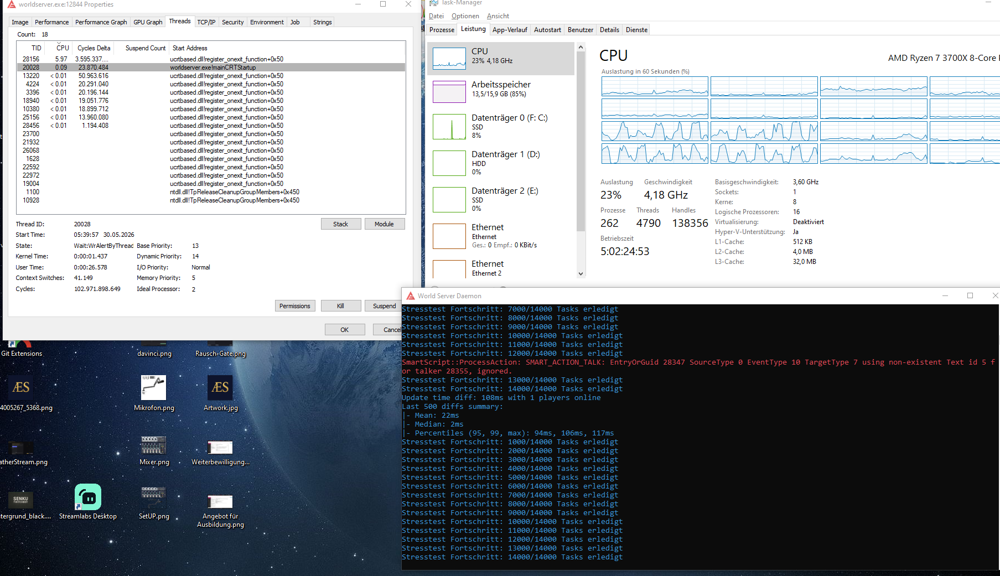

## mod_controller
A high-performance, multi-threaded task controller for AzerothCore.

## Overview
mod_controller is designed to solve one of the biggest challenges in module development: Main-thread blocking. By offloading intensive or long-running tasks into a dedicated thread pool, this module ensures that your core gameplay remains fluid regardless of background processing load.

## Features
Asynchronous Execution: Dispatch tasks to a background thread pool using sController->DispatchAsync.

Producer-Consumer Architecture: Built for thread-safe, high-volume task handling.

Zero Main-Thread Lag: Keeps the worldserver tick rate stable even under heavy stress.

Configurable Pool: Easily scalable worker threads for custom performance requirements.

## Stress Test Results
The module has been successfully tested under extreme conditions (14,000 tasks processed concurrently) without any impact on the main server loop or player latency.

## Getting Started
To use the controller, simply dispatch your tasks from anywhere in your module:

## C++
sController->DispatchAsync( {
    // Your heavy background logic goes here
});
Contributions
Contributions are welcome! Feel free to open a Pull Request if you have suggestions for improvement.
